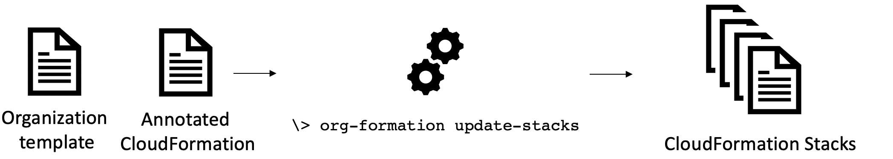

# AWS Organization Formation

AWS Organization Formation is an Infrastructure as Code (IaC) tool for AWS Organizations.

## Features

AWS Organization Formation (also: ``org-formation``) has 3 main features:

1. Infrastructure as Code for AWS Organizations:
[](docs/organization-resources.md)
[Organization resources reference](docs/organization-resources.md) | [Example organization file](examples/organization.yml) | [CLI Reference](docs/cli-reference.md)


&nbsp;

2. CloudFormation annotations to provision resources cross account:
[](docs/cloudformation-resources.md)
[Annotated CloudFormation reference](docs/cloudformation-resources.md) | [Examples](examples/) | [CLI Reference](docs/cli-reference.md)


&nbsp;


3. Automation of account creation and resource provisioning:
[](docs/task-files.md)
[Automation task file reference](docs/task-files.md) | [Example tasks file](examples/organization-tasks.yml) | [CLI Reference](docs/cli-reference.md)


Want more? here a [list of 50+ features](docs/features.pdf) 😎😎😎

## Installation
With [npm](https://npmjs.org/) installed, run
```
> npm install -g aws-organization-formation
```

You can now execute the commandline program `org-formation`. try:

```
> org-formation --help
```

## Getting started

💡Need help getting started? [Get some on slack!](https://join.slack.com/t/org-formation/shared_invite/enQtOTA5NjM3Mzc4ODUwLTMxZjYxYzljZTE5YWUzODE2MTNmYjM5NTY5Nzc3MzljNjVlZGQ1ODEzZDgyMWVkMDg3Mzk1ZjQ1ZjM4MDhlOGM)

To get started you first need an ``org-formation`` template that describes all your Organization resources such as [Accounts](./docs/organization-resources.md#account), [OUs](./docs/organization-resources.md#organizationalunit) and [SCPs](docs/organization-resources.md#servicecontrolpolicy).

After [Installation](#installation) you can generate this file using the following command:

```
> org-formation init organization.yml  --region us-east-1 [--profile org-master-account]
```

<details>
<summary>
example output organization.yml file
</summary>

```yaml
AWSTemplateFormatVersion: '2010-09-09-OC'

Organization:
  Root:
    Type: OC::ORG::MasterAccount
    Properties:
      AccountName: My Organization Root
      AccountId: '123123123123'
      Tags:
        budget-alarm-threshold: '2500'
        account-owner-email: my@email.com

  OrganizationRoot:
    Type: OC::ORG::OrganizationRoot
    Properties:
      ServiceControlPolicies:
        - !Ref RestrictUnusedRegionsSCP

  ProductionAccount:
    Type: OC::ORG::Account
    Properties:
      RootEmail: production@myorg.com
      AccountName: Production Account
      Tags:
        budget-alarm-threshold: '2500'
        account-owner-email: my@email.com

  DevelopmentAccount:
    Type: OC::ORG::Account
    Properties:
      RootEmail: development@myorg.com
      AccountName: Development Account
      Tags:
        budget-alarm-threshold: '2500'
        account-owner-email: my@email.com

  DevelopmentOU:
    Type: OC::ORG::OrganizationalUnit
    Properties:
      OrganizationalUnitName: development
      Accounts:
        - !Ref DevelopmentAccount

  ProductionOU:
    Type: OC::ORG::OrganizationalUnit
    Properties:
      OrganizationalUnitName: production
      Accounts:
        - !Ref ProductionAccount

  RestrictUnusedRegionsSCP:
    Type: OC::ORG::ServiceControlPolicy
    Properties:
      PolicyName: RestrictUnusedRegions
      Description: Restrict Unused regions
      PolicyDocument:
        Version: '2012-10-17'
        Statement:
          - Sid: DenyUnsupportedRegions
            Effect: Deny
            NotAction:
              - 'cloudfront:*'
              - 'iam:*'
              - 'route53:*'
              - 'support:*'
            Resource: '*'
            Condition:
              StringNotEquals:
                'aws:RequestedRegion':
                  - eu-west-1
                  - us-east-1
                  - eu-central-1
```

</details>

**Note**: If you prefer to set up CI/CD run ``org-formation init-pipeline`` instead. It will create a CodeCommit repository and CodePipeline that will update your organization upon every commit!

You can make changes to the file you generated  and upate your organization using the ``update`` commmand. Alternatively you can run ``create-change-set`` and ``update-change-set``. Read more in the [cli reference](docs/cli-reference.md)

Once you got the hang of managing organization resources, use these organization resources to write smarter cloudformation that allows you to provision resources across your organization. Read more [about managing resources across accounts](docs/cloudformation-resources.md).

## Why is this important?

Just like with the resources within your AWS Account, managing AWS Organization resources **as code** allows you to apply changes automatically, reducing manual work, inconsistencies and mistakes.

If you are considering to use an account vending machine (e.g. [AWS Control Tower](https://aws.amazon.com/controltower/)) to create and manage new accounts within your organization: Do realize that the account vending machine allows you to quickly create organization resources but only has limited facilities when it comes to updating and maintaining these resources.


## Questions and Answers

<details>
<summary>
My operation takes a long time to complete / is slow.
</summary>

Especially if you have a lot of accounts this can happen.

An easy way to speed things up is by specifying the commandline argument `--max-concurrent-stacks 10` where 10 is the number of stacks to run in concurrently.

Another way to speed things up is to run tasks in parallel this can be done with the argument `--max-concurrent-tasks 10`. This, however, has the side-effect that the logging might be somewhat harder to ralate to a specific task (as it might be out of order).

</details>

<details>
<summary>
Is there a way around having to create new email accounts per account?
</summary>

Every AWS Account needs a unique root email address, there is no way around this...

What you **can do** however is however is see whether your mailserver allows you to append a '+' (plus sign) and another secondary name to your account to create new unique email addresses.

Email to there addresses will end up in the mailbox assigned to the alias before the plus sign and this will still be considered a valid and unique emailaddress when creating a new AWS Account.

**Example:**
If your emailaddress is `name@gmail.com` you will receive email send to `name+awsaccount1@gmail.com` and `name+awsaccount2@gmail.com` to your inbox.

Mailservers that support this are gmail, aws workmail and hotmail.

</details>

<details>
<summary>
What is the password of the root user for newly created accounts?
</summary>

Accounts that are created have a root user but **no password**.

You can create a password using the 'Forgot password' process using the root email.

**Note:** Once you have created a password and used it consider to throw the password away. You are not supposed to log in using root anyway and storing your password somewhere could only lead to losing it. As we just figured out above you didnt need it in the first place.

**Do bind** an MFA on your root user! Find info under the [IAM service section of the console](https://console.aws.amazon.com/iam/home?/security_credentials#/home)

**Needless to add?** dont use a virtual MFA on the same device that has access to the email account used as RootEmail... this reduces your 'multi factor' authentication to a single factor 🤔🤣

</details>

<details>
<summary>
What happens when I remove an account from the organization.yml?
</summary>

If you remove an account from the organization it will not be deleted. Deleting accounts using api calls is not supported by AWS.

After running `update` the account that is removed from the organization will be not be able to be part of organization bindings.

```
\> org-formation update ./examples/organization.yml --profile org-formation
OC::ORG::Account              | Development4Account           | Forget
OC::ORG::OrganizationalUnit   | DevelopmentOU                 | Detach Account (Development4Account)
OC::ORG::OrganizationalUnit   | DevelopmentOU                 | CommitHash
```

After running `update-stacks` any stack that was deployed to this account using org-formation will be deleted from the target account. Stacks that have been created by other means will not be affected.

Obviously: having a task file will do both `update` and `update-stacks` in the right sequence and you're done!

If you removed and account and want to re-add it:
Just add it back to the organization.yml. Make sure you run `update` and `update-stacks` (or `perform-tasks`) and your account will particapate in all bindings and the stacks will be re-deployed to the account.

As long as the account was not deleted in full `org-formation` will identify it by the `RootEmail` (or `AccountId`) attribute in the organization.yml

</details>


<details>
<summary>
What happens when I rename an account (AccountName attribute) in org-formation?
</summary>

Renaming accounts is not possible using API's. You will have to log into the account as root to change the account name in AWS.

If you change the AccountName attribute in org-formation this will warn you about the above and will, when resolving references to the account, use the account name from the organization.yml file.

</details>


<details>
<summary>
What happens when I rename an account (logical name) in org-formation?
</summary>

The logical name, just like with CloudFormation is how you refer to the account from within your templates. The logical account is also used as an identifier within org-formation.

If you rename an account, by its logical name, org-formation will first notice that the resource by the old logical name has gone and `forget` it. Later it will discover the new same account by its new logical name and match it with the physical account that already exists in AWS. It will match the two thus completing the rename.

</details>


<details>
<summary>
Why is nesting OU's or a custom OrganizationAccessRole not supported?
</summary>

No reason other than not running into this usecase so far.

Really happy to implement this based on someone else's usecase.

</details>


## More docs

- [Examples](examples/)
- [List of 50+ features](docs/features.pdf)
- [Managing AWS Organizations as code](docs/organization-resources.md)
- [Organization Annotated CloudFormation](docs/cloudformation-resources.md)
- [Automating deployments](docs/task-files.md)
- [CLI reference](docs/cli-reference.md)
- [Changelog](CHANGELOG.md)

## Sponsors & collaborators

Special thanks to the following companies:

[](https://www.moneyou.nl)

[](https://www.chainslayer.io/)

Special thanks to the following individuals:
- [Tjerk Stroband](https://github.com/tstroband)
- [Yan Cui](http://theburningmonk.com)