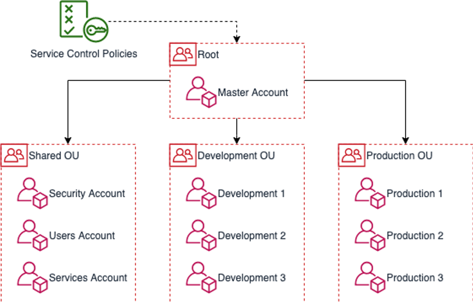
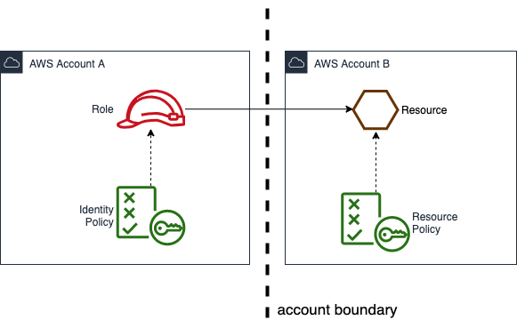
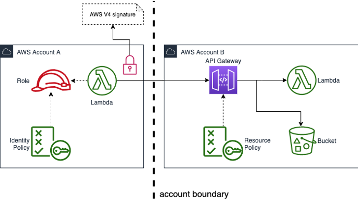

# Off to a great start with AWS Organizations

For those who do not know the AWS Organization service: AWS Organization allows you to create new AWS Accounts and manage these accounts centrally from within the account you used to create them (the Master Account).

Each account will have its own account-id, resources and resource limits just like any other account you might get from AWS.

The Organizations Service (in the Master Account) can also be used to organize these accounts in a hierarchical structure and put restrictions and policies on specific accounts or parts of the organization hierarchy.

This article will help you come up with a rationale on how to devide your workload over different AWS Accounts.

In the diagram above you see an example account structure split up in 3 organizational units (*development*, *shared* and *production*). Any number of accounts can be added to these organizational units. Organization structures can be a lot more complex than the above and some companies use this to manage 500+ accounts.

Using multiple accounts has a number of benefits:

-	**Data governance**: Storing data in different accounts makes it easy to control who has access to what data. Think of, for example, GDPR governed data: By only providing access to only those people that need access it easy to stay *- and demontrate you are -* in control.

-	**Security boundaries**: Security controls (e.g. IAM permissions) typically only apply to specific types of resources. Creating and maintaining specific permissions for those resources can be a difficult task. By moving more critical resources to different accounts you can apply these controls to an entire account (or group of accounts). For more information read about: Service Control Policies

-	**Scalability**: If you have a number of development teams working on the same AWS Account, you might run into AWS Service limits faster. Example: the maximum number of buckets that can be contained within an account is 100. If every team has their own AWS account you have a 100 buckets per team. Also, the team will be able to make good decisions on which buckets can be removed if needed.

-	**Limited blast radius**: Every once in a while, change might come with unwanted side-effects. Limiting these side effects is what we call limiting your blast radius. Resources that reside inside the same account are a lot more likely to get confused for one another or otherwise technically impact each other. Dividing your system over several accounts greatly reduces your blast radius.

-	**Cost monitoring**: All accounts within an AWS Organization are billed to the account that contains the Organization. What you do get however is analytics on your spent per account (without having to do tagging!). This way you can precisely monitor the spent of specific development teams or systems and set budget alarms for these accounts.

Even if you do not have a large number of accounts, it might still make sense to separate a development account from production. Starting off on the right foot helps you a lot in being able to grow and stay in control of your AWS resources in the future.

## Cross account resource access

We just learned about benefits from having a multi account setup. Though, specifically the hard security boundary also comes with a drawback: When accessing resources across accounts you now explicitly need to allow other accounts to access these resources.

In this example Account B allows Account A to a resource

- On the left see the `identity policy`: Most developers that work with AWS know this as the role they assume as a user or the role assigned to a lambda or other executable. This identity policy will need to contain the complete ARN of the resource in Account B.

- On the right you see the resource also has a policy: the `resource policy`. All resources have a resource policy and this policy specifies who is allowed to access the resource. By default, the resource policies allow access from within the same account, but in order to access resources across account boundaries **both policies need to permit access**.

More information about IAM policies and permissions can be found here: https://docs.aws.amazon.com/IAM/latest/UserGuide/access_policies.html

## Coming up with a multi account strategy

As we learned having multiple accounts can help us be in control of our AWS resources, but also comes with draw backs. Therefore, it is important to come up with a rationale as to when to separate resources into different accounts.

### Development and production accounts

It makes sense to separate development resources from production resources:
1. You don't want to accidentally impact production systems when developing a new feature.
2. Your production system might contain confidential or GDPR-governed data, which you don't want to expose to developers by default.

By splitting the development and production accounts in different organizational units you will be able to: create policies that will prevent tables being dropped on production, limit access to data or notify administrators when developers access production resources (a break-glass role).

##### Development account per team

When creating development accounts in a development OU it makes sense to have 1 AWS account per team. This way the team members can have a broad set of permissions, fix any limit or issues they run into on their own account and won’t get in the way of other development teams.

##### Production account per system

When creating production accounts try to design these around (sub) systems in which the resources highly depend on each other and likely need to changed and deployed together. Much like one would design microservices. When having dependencies across these systems you can use API Gateway and HTTP endpoints as a generic way of decoupling these services.

For API Gateway endpoints that should only be exposed within your organization you can also use resource policies. Again, both the caller identity and the API gateway resource policies need to allow access. In order for this to work the caller will need to add an AWS V4 signature to the HTTP request.

### Shared Accounts

There are also different motivations to store resources in shared accounts. Some examples below:

**Shared Service Account**
Contains re-usable functions / services / resources.

Benefit:
- Storing resources you re-use in a central place makes it easier to manage these resources.

**Audit Logging Account**
Contains centralized logging for services like Cloudtrail, Config and GuardDuty.

Benefit:
- Storing audit logging makes it easy to access.
- Access to Audit Logging might also be limited to roles like your Security Officer.

**Application Logging Account**
Contains centralized logging and metrics data for all applications.

Benefit:
- Storing logging and metrics for all applications features makes it easy to access, correlate and forward logs.
- A single place toset up alarms and alert the devops engineer on duty.

**Users Account**
Contains IAM Users or integration with SSO solution.

Benefit:
- By having a single account that contains all users it is easy to stay in control of the IAM Roles your users are allowed to assume.

**Security Account**
Contains passwords, api keys, certificates, public keys, etc.

Benefit:
- Storing secrets centrally allows you to easily rotate secrets when needed.
- Having a specific account where these secrets are stored allows you limit access. Example: Only your Security Officer might be allowed access to this account.

## Managing your AWS Organization using IaC
AWS has offered several solutions to set up an AWS Organization (Landing Zones, Landing Zones V2 and AWS Control Tower). These solutions have in common that they allow you to create an AWS Organization and account structure as well provision a baseline of AWS resources using an Account Factory or Account Vending Machine. None of these services however allow you to manage your AWS Organization using Infrastructure as Code (also referred to as IaC). However, the open source managed tool AWS Organization Formation (or org-formation) does.

Organization Formation allows you to keep the definition of your AWS Organization under source control and create an automated process to apply changes. Automating the process of making changes to your AWS Organization removes manual work, inconsistency and mistakes. Automated build infrastructure also allows you to enforce safeguards such as peer-reviews on changes.

Check it out: https://github.com/OlafConijn/AwsOrganizationFormation

Issues, stars, pull requests and examples are welcome! <3

