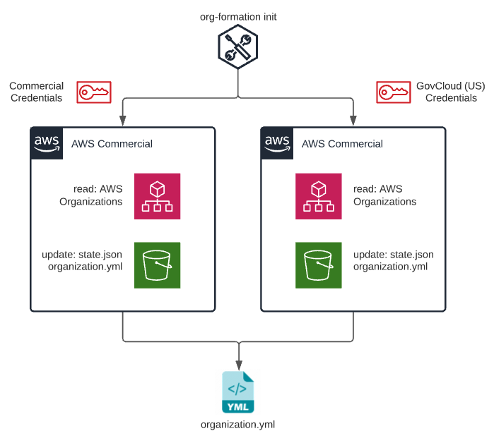
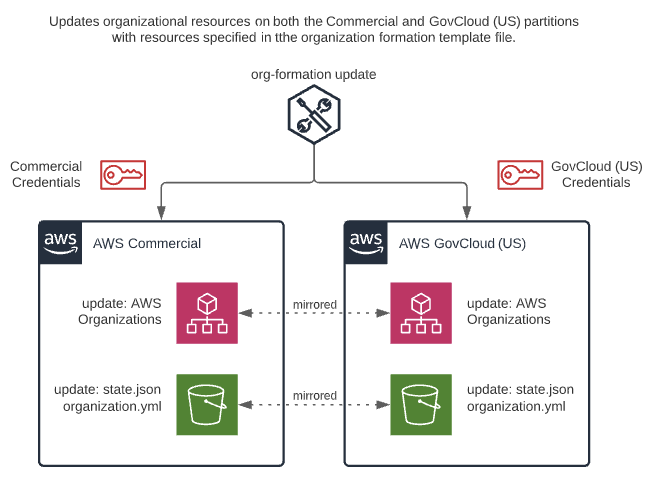
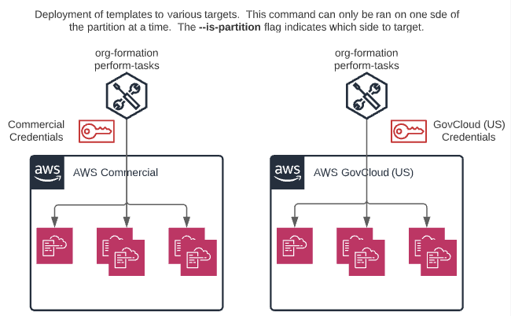

# GovCloud (US) Partition
Certain use cases may require that you run your workloads in a AWS partition other than `aws` also known as the commercial partition.  While it is our intention to support all partitions (US GovCloud, China, Secret Region) support has started for us-gov. Below you can find examples of how to perform Org Formation commands in the context of the us-gov partition.

> **important**:  Each GovCloud (US) account is tied to a commercial account for billing.  You cannot have a GovCloud (US) account without a commercial account.  This means that Org Formation is required to managed both partitions simutaneously.  Org Formation does this by "mirroring" these accounts.  The `organization.yml` file looks the same as you would expect, with some slight differences.

``` yaml
OrganizationRoot:
    Type: OC::ORG::OrganizationRoot
    Properties:
        MirrorInPartition: True
        DefaultOrganizationAccessRoleName: OrganizationAccountAccessRole
```

The `MirrorInPartition` attribute on the `OC::ORG::OrganizationRoot` resource indicates to org formation that when accounts are created or modified to do so in both the commercial and us-gov partitions.  Currently this is a boolean value, however, in the future it should inidicate which partition to mirror in.

``` yaml
TestAccount:
    Type: OC::ORG::Account
    Properties:
        AccountName: test
        RootEmail: email@example.com
        Alias: test-c
        PartitionAlias: test-gc
```

> **note:** `Alias` and `PartitionAlias` must be **different** values

The `PartitionAlias` attribute on the `OC::ORG::Account` resource type indicates the account alias for the mirrored partition account.  To prevent confusion this alias should be different than the `Alias` attribute.

> **important**: Currently organizational units are **not** supported in non-commercial partition accounts and cannot be present in your `organization.yml` if you are mirroring across a different partition.

### ``org-formation init``

Creates a local organization formation file that contains all organization resources. Running this command will create an S3 Bucket (hence the region) in your account that contains a state file which is used to track differences when updating your resources.

``> org-formation init organization.yml --region us-east-1 --partition-region us-gov-west-1 --partition-profile myProfile``  

A few new attributes are required for org formation to work properly across partitions:
   - `--partition-region` string indicating which region to target in the partition. Defaults to `us-gov-west-1`.
   - `--partition-profile` is an optional string argument indicating where org formation can find credentials to access the partition.  
   - `--partition-keys` is an optional boolean argument indicating org formation to look for partition credentials as environment variables (`GOV_AWS_ACCESS_KEY_ID` and `GOV_AWS_SECRET_ACCESS_KEY`).  
   
> **important**: This command must be executed from a terminal session with active AWS credentials to the commercial management account.  One of the `--partition-profile` or `--partition-keys` arguments must be passed.



### ``org-formation update``

Updates organizational resources specified in templateFile.

``> org-formation update org-formation update organization.yml --partition-region us-gov-west-1 --partition-profile myProfile``  

Again, when running org-formation update partition arguments are required for org formation to have proper access to both the commercial and mirrored partition.  The Update command will "mirror" the organization on both sides of the partition.

> **note**: There are org formation state files on both sides of the partition.  Meaning when you create an organization an s3 bucket is created in both commercial and gov cloud master accounts.



## Running Tasks
Tasks can only be ran on specific partitions (commercial or mirrored partition i.e. us-gov).
   - To run commercial tasks:  
   `` > org-formation perform-tasks _commercial-tasks.yml [--profile my-aws-profile]``  

   - To run gov cloud tasks pass the `--is-partition` and `--partition-region` arguments:  
   `` > org-formation perform-tasks _govcloud-tasks.yml --is-partition --partition-region us-gov-west-1``  

> **note**: Currently `update-organization` tasks types are not supported within your task files.


