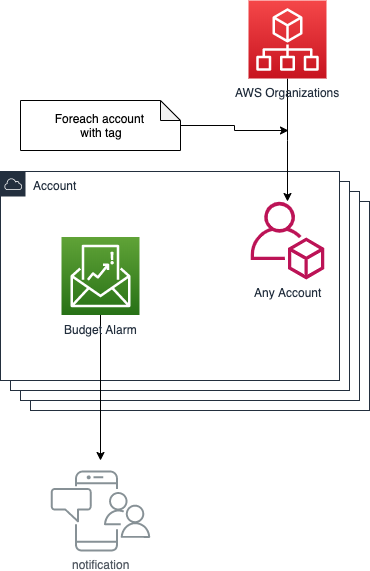
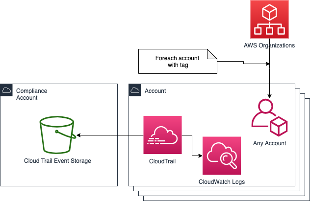
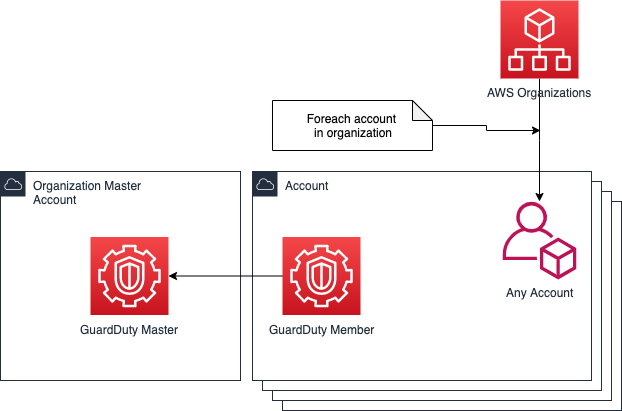
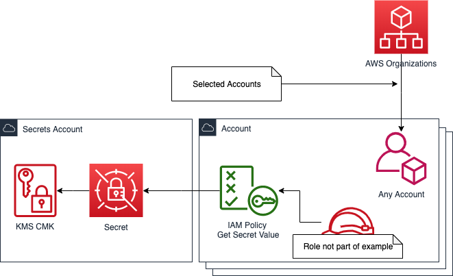

# Examples
<!-- @import "[TOC]" {cmd="toc" depthFrom=2 depthTo=6 orderedList=false} -->

<!-- code_chunk_output -->

- [Examples](#examples)
  - [budget alarms](#budget-alarms)
  - [cloudtrail](#cloudtrail)
  - [guardduty](#guardduty)
  - [cross account bucket](#cross-account-bucket)
  - [cross account role](#cross-account-role)
  - [cross account secret](#cross-account-secret)
  - [cross account lambda](#cross-account-lambda)

<!-- /code_chunk_output -->

## budget alarms

Basic example on how to create budget alarms based on tags that are defined on the account.

[budget-alarms.yml](budget-alarms.yml)

## cloudtrail

Example on how to do a basic cloud trail implementation. Demonstrates cross account references

[cloudtrail.yml](cloudtrail.yml)

## guardduty

Example on how to do a basic guardduty implementation. Demonstrates cross account references / ForeachElement / DependsOnAccount

[guardduty.yml](guardduty.yml)

## cross account bucket

Reusable template to do cross account access to S3 bucket.

[cross-account-bucket.yml](cross-account-bucket.yml)

## cross account role

Reusable template to do cross account IAM roles.

[cross-account-role.yml](cross-account-role.yml)

## cross account secret

Reusable template to do cross account secretsmanager secrets.

[cross-account-secret.yml](cross-account-secret.yml)

## cross account lambda

Reusable template to do cross account lambdas. Assumes the lambda is deployed by another means (serverless? SAM?)

[cross-account-lambda.yml](cross-account-lambda.yml)

