# Examples
<!-- @import "[TOC]" {cmd="toc" depthFrom=2 depthTo=6 orderedList=false} -->

<!-- code_chunk_output -->

- [organization](#organization)
- [organization tasks](#organization-tasks)
- [budget alarms](#budget-alarms)
- [cloudtrail](#cloudtrail)
- [guardduty](#guardduty)
- [subdomains](#subdomains)
- [cross account bucket](#cross-account-bucket)
- [cross account role](#cross-account-role)
- [cross account role with alarm](#cross-account-role-with-alarm)
- [cross account secret](#cross-account-secret)
- [cross account lambda](#cross-account-lambda)
- [wildcard certs (2 regions)](#wildcard-certs-2-regions)
- [custom account creation workflow](#custom-account-creation-workflow)
- [Terraform](#terraform)

<!-- /code_chunk_output -->

## organization

Basic organization that demonstrates most of the IaC features for AWS Organizations: [organization.yml](organization.yml)

[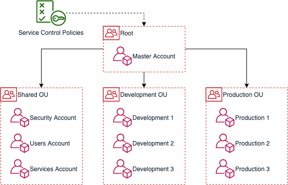](organization.yml)

## organization tasks

Basic taskfile that contains all examples below: [organization-tasks.yml](organization-tasks.yml). Includes another taskfile [organization-iam-tasks.yml](organization-iam-tasks.yml) which contains roles.

## budget alarms

> Note: This feature needs [Billing Alerts](https://docs.aws.amazon.com/AmazonCloudWatch/latest/monitoring/gs_monitor_estimated_charges_with_cloudwatch.html#gs_turning_on_billing_metrics) and [Access to the Billing and Cost Management console](https://docs.aws.amazon.com/awsaccountbilling/latest/aboutv2/control-access-billing.html#ControllingAccessWebsite-Activate) enabled in the Organizations Root Account. It might need up to 24 hours until these changes are propagated and a deployment of this example is possible.

Basic example on how to create budget alarms based on tags that are defined on the account.

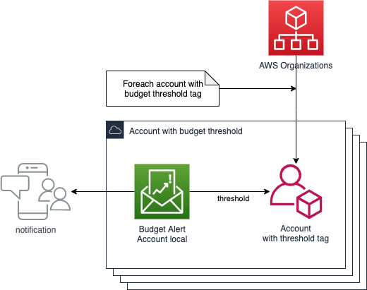

[templates/budget-alarms.yml](templates/budget-alarms.yml)

## cloudtrail

Example on how to do a basic cloud trail implementation. Demonstrates cross account references

[templates/cloudtrail.yml](templates/cloudtrail.yml)

## guardduty

Example on how to do a basic guardduty implementation. Demonstrates cross account references / ForeachElement / DependsOnAccount

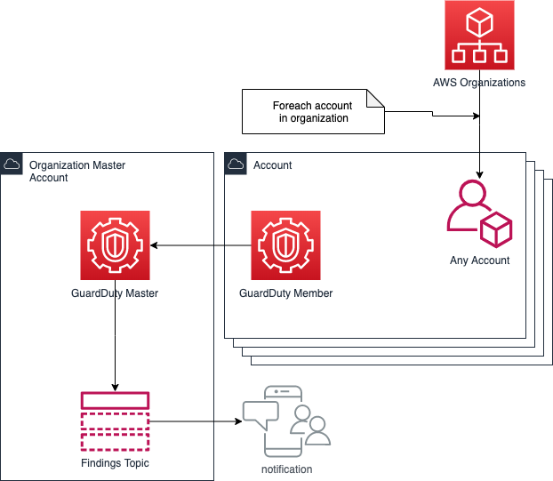

[templates/guardduty.yml](templates/guardduty.yml)

## subdomains

Example on how to provision route 53 subdomains for all accounts within your organization based on a tag and including a root hosted zone in the organization master account.

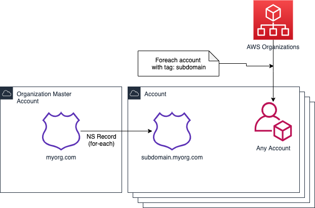

[templates/subdomains.yml](templates/subdomains.yml)

## cross account bucket

Reusable template to do cross account access to S3 bucket.

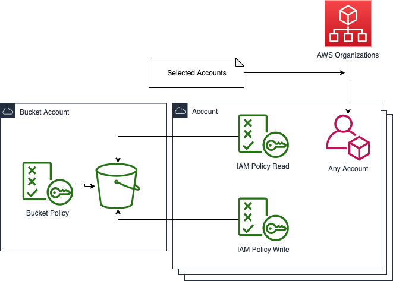

[templates/cross-account-bucket.yml](templates/cross-account-bucket.yml)

## cross account role

Reusable template to do cross account IAM roles.

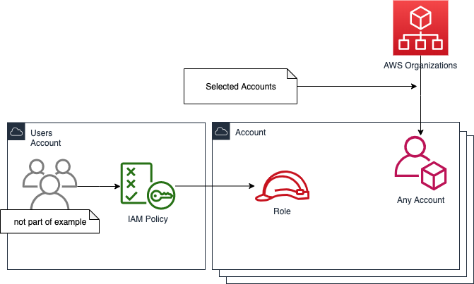

[templates/cross-account-role.yml](templates/cross-account-role.yml)

## cross account role with alarm

Reusable template to do cross account IAM roles with an alarm (based on CloudTrail)

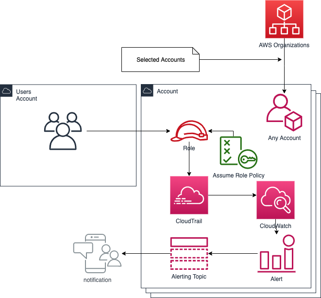

[templates/cross-account-role-with-alarm.yml](templates/cross-account-role-with-alarm.yml)

## cross account secret

Reusable template to do cross account secretsmanager secrets.

[templates/cross-account-secret.yml](templates/cross-account-secret.yml)

## cross account lambda

Reusable template to do cross account lambdas. Assumes the lambda is deployed by another means (serverless? SAM?)

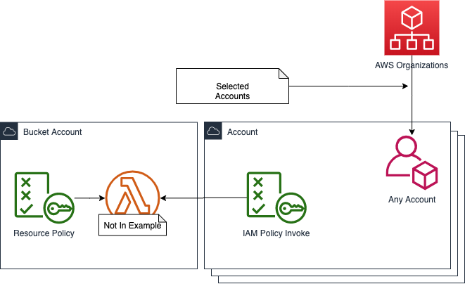

[templates/cross-account-lambda.yml](templates/cross-account-lambda.yml)

## wildcard certs (2 regions)

Template that demonstrates provisioning wildcard certificates in both us-east-1 and another region while having the ARNs to these certicates stored locally in SSM.

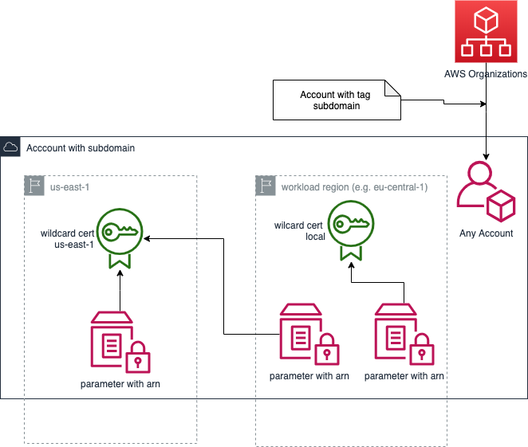

[templates/wildcard-certs.yml](templates/wildcard-certs.yml)

## custom account creation workflow

Serverless project that demonstrate how to customize and extern the account creation process using CloudWatch/ EventBridge event rules and StepFunctions

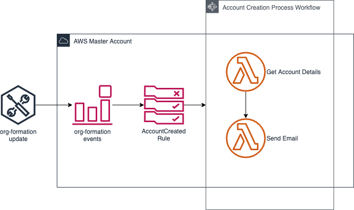

[automation/create-account](automation/create-account)

## Terraform

Example implementation for deploying infrastructure using Terraform with an S3 Bucket as backend.

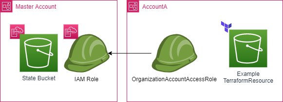

[terraform](terraform)
